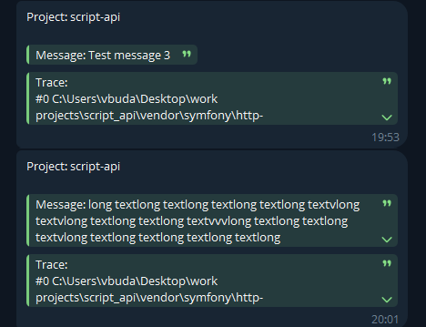

# LinkageCRM

Symfony-bundle для отправки сообщений в ТГ о выбрасываемых исключениях в prod окружении.

## Установка:
1) Установка выполняется через [пакетный менеджер composer](https://getcomposer.org/doc/01-basic-usage.md)
```
composer require linkage-crm/critical-alerting-bundle
```

2) Добавить в config/bundles.php строку с этим бандлом:
```php
<?php 

return [
    // Others bundles
    LinkageCrm\CriticalAlertingBundle\CriticalAlertingBundle::class => ['prod' => true],
];
```


## Необходимые переменные в **env-файлах**
```
APP_ENV=prod

CRITICAL_ALERTING_PROJECT_NAME=<your_project_name>
CRITICAL_ALERTING_TG_BOT_TOKEN=<your_bot_token>
CRITICAL_ALERTING_TG_CHAT_ID=<your_chat_id>
```

## Примеры:

1) Через наследование исключения TelegramNotifiableException:

```php
use LinkageCrm\CriticalAlertingBundle\Exception\Notifiable\TelegramNotifiableException;

class MyCustomException extends TelegramNotifiableException
{

}

try{
    // Your code which throws MyCustomException
} catch (MyCustomException $e){
    // Handling exception
}
```

2)  Без наследования TelegramNotifiableException:

```php
use LinkageCrm\CriticalAlertingBundle\Exception\Notifiable\TelegramNotifiableException;

try{
    // Your code which throws TelegramNotifiableException
} catch (TelegramNotifiableException $e){
    // Handling exception
}
```

3) Собственное исключение с другой логикой уведомления:

```php
use LinkageCrm\CriticalAlertingBundle\Exception\Notifiable\AbstractNotifiableException;

class MyCustomException extends AbstractNotifiableException
{
    protected function notify(): void
	{
	    // Your notification logic
	}
}

try{
    // Your code which throws MyCustomException
}
catch (MyCustomException $e){
    // Handling exception
}
```

4) Уведомление при возникновении любого необработанного исключения будет отправлено автоматически

```php
function foo(){
    // some logic
    throw new Exception();
}

foo();
```

## Вид сообщения с ошибкой:
1) Название сервера
2) Текст ошибки
3) Файл ошибки
4) Строка ошибки

